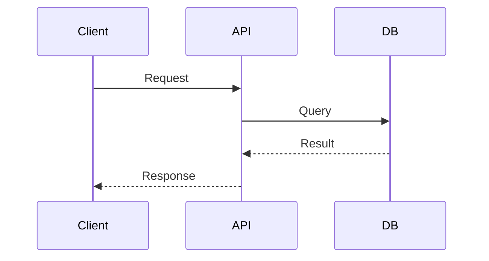

# Diagram Generation Skill

Multi-format diagram generation from text descriptions.

## Overview

This skill provides comprehensive diagram generation capabilities using text-based diagram languages. It supports Mermaid, PlantUML, D2, and Graphviz for creating flowcharts, sequence diagrams, architecture diagrams (C4), and data models.

## When to Use

- Creating architecture documentation
- Generating sequence diagrams for API flows
- Building data model visualizations
- Creating flowcharts and decision trees
- Documenting system dependencies

## Quick Start

### Mermaid Flowchart

```json
{
  "type": "mermaid",
  "diagramType": "flowchart",
  "source": "flowchart TD\n  A-->B-->C",
  "outputPath": "docs/flow.svg"
}
```

### C4 Architecture

```json
{
  "type": "plantuml",
  "diagramType": "architecture",
  "inputPath": "diagrams/system.puml",
  "outputPath": "docs/architecture.svg"
}
```

## Supported Formats

| Tool | Diagram Types | Output |
|------|---------------|--------|
| Mermaid | Flowchart, Sequence, Class, ER, State | SVG, PNG |
| PlantUML | C4, Sequence, Class, Activity | SVG, PNG, PDF |
| D2 | Architecture, Flow, Sequence | SVG, PNG |
| Graphviz | Dependency, Network, Hierarchy | SVG, PNG |

## Diagram Examples

### Mermaid Sequence



### C4 Context

```plantuml
@startuml
!include C4_Context.puml
Person(user, "User")
System(sys, "System")
Rel(user, sys, "Uses")
@enduml
```

### D2 Architecture

```d2
users -> frontend -> api -> database
```

## CLI Commands

```bash
# Mermaid
npx mmdc -i diagram.mmd -o diagram.svg

# PlantUML
java -jar plantuml.jar diagram.puml

# D2
d2 diagram.d2 diagram.svg

# Graphviz
dot -Tsvg diagram.dot -o diagram.svg
```

## Process Integration

| Process | Usage |
|---------|-------|
| `arch-docs-c4.js` | Architecture documentation |
| `data-model-docs.js` | ER diagrams |
| `api-reference-docs.js` | API flow diagrams |
| `adr-docs.js` | Decision diagrams |

## Dependencies

- @mermaid-js/mermaid-cli
- PlantUML JAR
- D2 CLI
- Graphviz

## References

- [Mermaid](https://mermaid.js.org/)
- [PlantUML](https://plantuml.com/)
- [D2](https://d2lang.com/)
- [C4 Model](https://c4model.com/)

## Version History

| Version | Date | Changes |
|---------|------|---------|
| 1.0.0 | 2026-01-24 | Initial release |

---

**Backlog ID:** SK-006
**Category:** Visual Documentation
**Status:** Active
