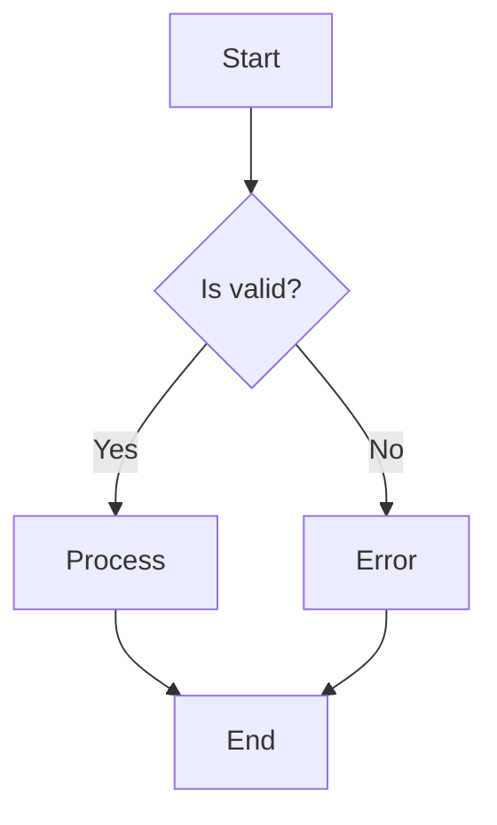
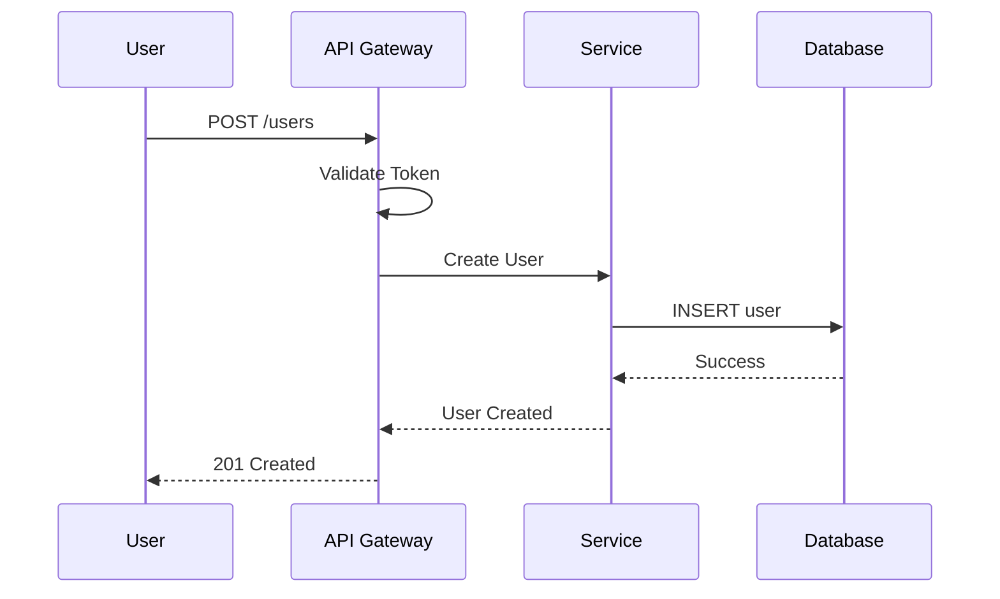
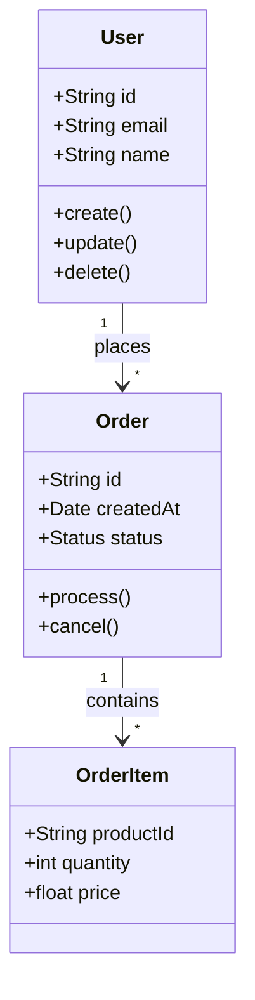
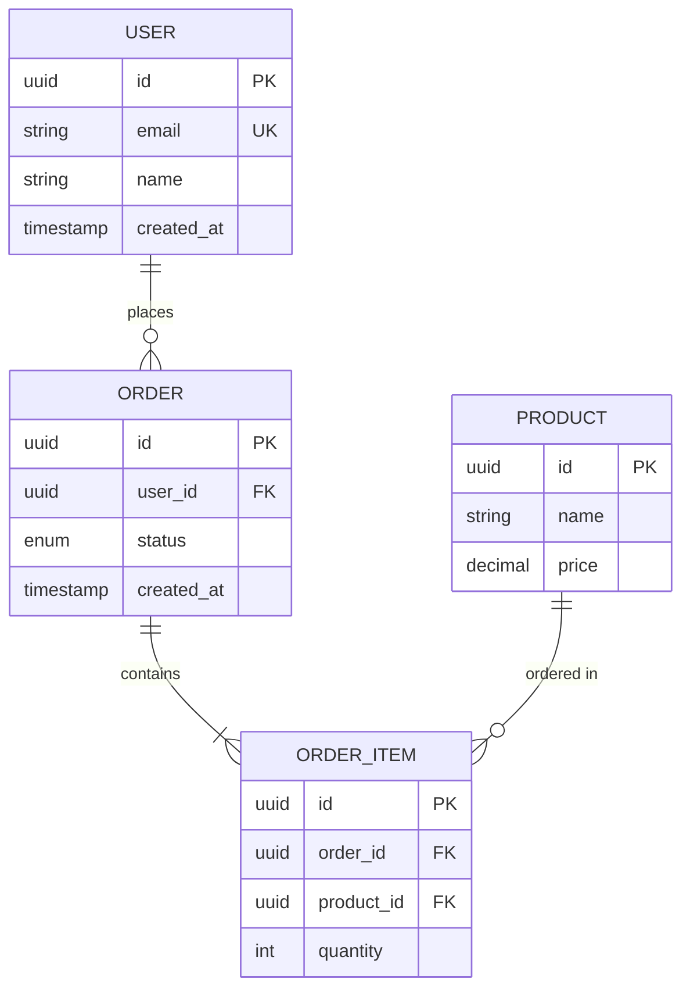
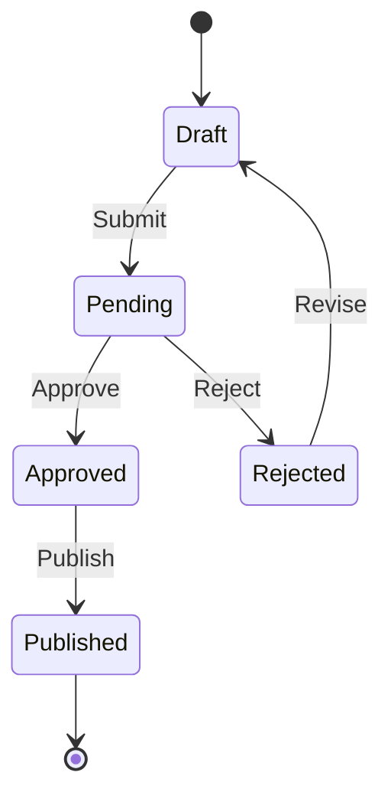
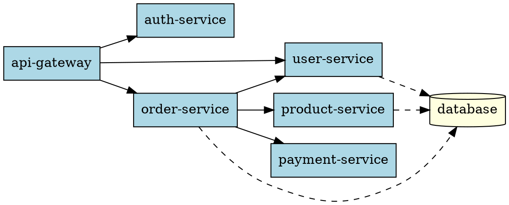

# Diagram Generation Skill

Multi-format diagram generation from text descriptions.

## Capabilities

- Mermaid diagram generation (flowcharts, sequence, class, ER)
- PlantUML diagram creation and rendering
- D2 diagram generation
- Graphviz DOT language support
- Architecture diagram generation (C4 model)
- Excalidraw integration for hand-drawn style
- Diagram accessibility analysis
- SVG/PNG export with optimization

## Usage

Invoke this skill when you need to:
- Create architecture diagrams
- Generate sequence diagrams
- Build data model visualizations
- Create flowcharts and decision trees
- Export diagrams in various formats

## Inputs

| Parameter | Type | Required | Description |
|-----------|------|----------|-------------|
| type | string | Yes | mermaid, plantuml, d2, graphviz, c4 |
| diagramType | string | Yes | flowchart, sequence, class, er, architecture |
| source | string | No | Diagram source code |
| inputPath | string | No | Path to diagram source file |
| outputPath | string | Yes | Output file path |
| format | string | No | svg, png, pdf (default: svg) |
| theme | string | No | Theme for styling |

### Input Example

```json
{
  "type": "mermaid",
  "diagramType": "sequence",
  "source": "sequenceDiagram\n  Client->>API: Request\n  API-->>Client: Response",
  "outputPath": "docs/diagrams/api-flow.svg",
  "format": "svg"
}
```

## Mermaid Diagrams

### Flowchart



### Sequence Diagram



### Class Diagram



### Entity Relationship Diagram



### State Diagram



## C4 Model Diagrams

### System Context

```plantuml
@startuml C4_Context
!include https://raw.githubusercontent.com/plantuml-stdlib/C4-PlantUML/master/C4_Context.puml

Person(user, "User", "A customer of the system")
System(system, "E-Commerce Platform", "Allows users to browse and purchase products")
System_Ext(payment, "Payment Gateway", "Processes payments")
System_Ext(email, "Email Service", "Sends notifications")

Rel(user, system, "Uses", "HTTPS")
Rel(system, payment, "Processes payments", "HTTPS")
Rel(system, email, "Sends emails", "SMTP")
@enduml
```

### Container Diagram

```plantuml
@startuml C4_Container
!include https://raw.githubusercontent.com/plantuml-stdlib/C4-PlantUML/master/C4_Container.puml

Person(user, "User")

System_Boundary(system, "E-Commerce Platform") {
    Container(spa, "Web Application", "React", "User interface")
    Container(api, "API Gateway", "Node.js", "REST API")
    Container(orders, "Order Service", "Go", "Handles orders")
    Container(products, "Product Service", "Go", "Product catalog")
    ContainerDb(db, "Database", "PostgreSQL", "Stores data")
    ContainerQueue(queue, "Message Queue", "RabbitMQ", "Async messaging")
}

Rel(user, spa, "Uses", "HTTPS")
Rel(spa, api, "Calls", "HTTPS")
Rel(api, orders, "Routes", "gRPC")
Rel(api, products, "Routes", "gRPC")
Rel(orders, db, "Reads/Writes", "SQL")
Rel(orders, queue, "Publishes", "AMQP")
@enduml
```

## D2 Diagrams

### Architecture Diagram

```d2
direction: right

users: Users {
  shape: person
}

frontend: Frontend {
  spa: React SPA
  mobile: Mobile App
}

backend: Backend Services {
  gateway: API Gateway
  auth: Auth Service
  orders: Order Service
  products: Product Service
}

data: Data Layer {
  postgres: PostgreSQL {
    shape: cylinder
  }
  redis: Redis Cache {
    shape: cylinder
  }
  s3: S3 Storage {
    shape: cylinder
  }
}

users -> frontend.spa
users -> frontend.mobile
frontend -> backend.gateway
backend.gateway -> backend.auth
backend.gateway -> backend.orders
backend.gateway -> backend.products
backend.orders -> data.postgres
backend.auth -> data.redis
backend.products -> data.s3
```

## Graphviz DOT

### Dependency Graph



## Configuration

### Mermaid Config

```json
{
  "theme": "neutral",
  "themeVariables": {
    "primaryColor": "#4a90d9",
    "primaryTextColor": "#fff",
    "primaryBorderColor": "#2d5986",
    "lineColor": "#5c6370",
    "secondaryColor": "#f0f0f0",
    "tertiaryColor": "#e8e8e8"
  },
  "flowchart": {
    "curve": "basis",
    "padding": 20
  },
  "sequence": {
    "actorMargin": 50,
    "boxMargin": 10
  }
}
```

## Workflow

1. **Parse source** - Load diagram definition
2. **Validate syntax** - Check for errors
3. **Apply theme** - Configure styling
4. **Render diagram** - Generate output
5. **Optimize** - Compress SVG/PNG
6. **Export** - Save to output path

## Dependencies

```json
{
  "devDependencies": {
    "@mermaid-js/mermaid-cli": "^10.0.0",
    "plantuml": "^0.1.0",
    "d2": "^0.6.0",
    "graphviz": "^0.0.9",
    "svgo": "^3.0.0"
  }
}
```

## CLI Commands

```bash
# Mermaid to SVG
npx mmdc -i diagram.mmd -o diagram.svg

# PlantUML to PNG
java -jar plantuml.jar diagram.puml

# D2 to SVG
d2 diagram.d2 diagram.svg

# Graphviz to PNG
dot -Tpng diagram.dot -o diagram.png

# Optimize SVG
npx svgo diagram.svg -o diagram.min.svg
```

## Best Practices Applied

- Use consistent direction (LR or TD)
- Limit nodes to 15-20 per diagram
- Use meaningful labels
- Group related components
- Include legends for complex diagrams
- Optimize for accessibility (color contrast)
- Version control diagram source

## References

- Mermaid: https://mermaid.js.org/
- PlantUML: https://plantuml.com/
- D2: https://d2lang.com/
- Graphviz: https://graphviz.org/
- C4 Model: https://c4model.com/

## Target Processes

- arch-docs-c4.js
- data-model-docs.js
- api-reference-docs.js
- adr-docs.js
